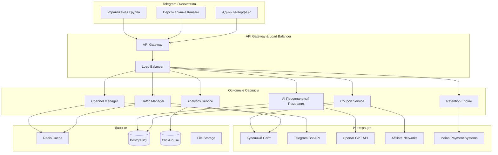

# Документ Дизайна

## Обзор

Zabardoo Telegram Bot представляет собой многоканальную экосистему, построенную на микросервисной архитектуре для максимизации удержания пользователей и конверсий в купонном бизнесе в Индии. Система включает управляемую ботом группу для создания купонов, персональные каналы-кабинеты для каждого пользователя, и бесшовную интеграцию с основным купонным сайтом.

Архитектура спроектирована для обработки большого трафика с фокусом на многократное взаимодействие с пользователями, персонализацию рекомендаций и максимизацию lifetime value каждого клиента.

## Архитектура

### Высокоуровневая Архитектура



### Архитектура Сервисов

Система построена на микросервисной архитектуре со следующими ключевыми сервисами:

1. **Channel Manager**: Управление персональными каналами и группой
2. **AI Персональный Помощник**: GPT-powered консультант для каждого пользователя
3. **Coupon Service**: Управление купонами и интеграция с сайтом
4. **Traffic Manager**: Отслеживание переходов и конверсий
5. **Analytics Service**: Аналитика поведения и эффективности
6. **Retention Engine**: Система удержания и реактивации пользователей
7. **Payment Integration**: Интеграция с индийскими платежными системами

## Компоненты и Интерфейсы

### Channel Manager

**Ответственности:**
- Создание и управление персональными каналами для каждого пользователя
- Модерация и управление основной группой
- Маршрутизация сообщений между каналами
- Синхронизация контента между группой и персональными каналами

**Ключевые Интерфейсы:**
```typescript
interface ChannelManager {
  createPersonalChannel(userId: string): Promise<ChannelInfo>
  sendToPersonalChannel(userId: string, message: PersonalMessage): Promise<void>
  moderateGroupMessage(groupId: string, messageId: string): Promise<ModerationResult>
  syncCouponToPersonalChannels(coupon: Coupon, targetUsers: string[]): Promise<void>
}

interface PersonalMessage {
  text: string
  couponData?: CouponData
  redirectUrl?: string
  trackingParams: TrackingParams
}

interface ChannelInfo {
  channelId: string
  userId: string
  isActive: boolean
  createdAt: Date
  lastActivity: Date
}
```

### AI Персональный Помощник

**Ответственности:**
- Персонализированные консультации по купонам в личных каналах
- Анализ истории покупок для улучшения рекомендаций
- Проактивные предложения на основе поведения пользователя
- Помощь в создании купонов в группе

**Ключевые Интерфейсы:**
```typescript
interface AIPersonalAssistant {
  generatePersonalizedRecommendation(userId: string, context: UserPurchaseHistory): Promise<CouponRecommendation>
  processPersonalQuery(userId: string, query: string): Promise<PersonalizedResponse>
  analyzeUserBehavior(userId: string): Promise<BehaviorInsights>
  suggestCouponCreation(groupMessage: string): Promise<CouponSuggestion>
}

interface CouponRecommendation {
  coupon: Coupon
  personalizedMessage: string
  redirectUrl: string
  confidence: number
  reasoning: string
}

interface BehaviorInsights {
  preferredCategories: string[]
  shoppingPatterns: ShoppingPattern[]
  bestTimeToEngage: TimeWindow
  churnRisk: number
}
```

### Coupon Service

**Ответственности:**
- Синхронизация купонов с основным купонным сайтом
- Создание аффилейтских ссылок с правильной атрибуцией
- Управление жизненным циклом купонов
- Интеграция с индийскими магазинами и партнерами

**Ключевые Интерфейсы:**
```typescript
interface CouponService {
  syncWithMainSite(): Promise<SyncResult>
  createAffiliateLink(couponId: string, userId: string, source: TrafficSource): Promise<string>
  getCouponsForUser(userId: string, preferences: UserPreferences): Promise<Coupon[]>
  trackCouponUsage(couponId: string, userId: string, action: CouponAction): Promise<void>
}

interface Coupon {
  id: string
  title: string
  description: string
  store: IndianStore
  category: string
  discountType: 'percentage' | 'fixed' | 'offer'
  discountValue?: number
  couponCode?: string
  directLink?: string
  sitePageUrl: string
  expiryDate?: Date
  isPopularInIndia: boolean
  supportedPayments: IndianPaymentMethod[]
}

interface IndianStore {
  name: string
  domain: string
  isPopular: boolean
  supportedRegions: string[]
  paymentMethods: IndianPaymentMethod[]
}
```

### Traffic Manager

**Ответственности:**
- Отслеживание всех переходов с Telegram на купонный сайт
- Атрибуция конверсий к правильным источникам трафика
- Оптимизация маршрутов для максимизации конверсий
- Интеграция с аналитикой сайта

**Ключевые Интерфейсы:**
```typescript
interface TrafficManager {
  trackClick(userId: string, couponId: string, source: TrafficSource): Promise<ClickEvent>
  trackConversion(clickId: string, conversionData: ConversionData): Promise<void>
  generateTrackingUrl(couponId: string, userId: string, source: TrafficSource): Promise<string>
  getTrafficAnalytics(timeRange: TimeRange): Promise<TrafficAnalytics>
}

interface ClickEvent {
  clickId: string
  userId: string
  couponId: string
  source: TrafficSource
  timestamp: Date
  userAgent: string
  redirectUrl: string
}

interface TrafficSource {
  type: 'personal_channel' | 'group' | 'ai_recommendation'
  channelId?: string
  messageId?: string
  campaignId?: string
}

interface ConversionData {
  orderId: string
  orderValue: number
  currency: 'INR'
  commission: number
  conversionTime: Date
}
```

### Retention Engine

**Ответственности:**
- Анализ поведения пользователей для предотвращения оттока
- Автоматические кампании реактивации
- Персонализированные стратегии удержания
- A/B тестирование retention стратегий

**Ключевые Интерфейсы:**
```typescript
interface RetentionEngine {
  analyzeChurnRisk(userId: string): Promise<ChurnAnalysis>
  triggerReactivationCampaign(userId: string, strategy: RetentionStrategy): Promise<void>
  scheduleFollowUpMessages(userId: string, purchaseData: PurchaseData): Promise<void>
  optimizeEngagementTiming(userId: string): Promise<OptimalTiming>
}

interface ChurnAnalysis {
  riskScore: number
  lastActivity: Date
  engagementTrend: 'increasing' | 'stable' | 'declining'
  recommendedActions: RetentionAction[]
}

interface RetentionStrategy {
  type: 'exclusive_offer' | 'personalized_discount' | 'category_reminder' | 'social_proof'
  message: string
  incentive?: Incentive
  timing: Date
}

interface OptimalTiming {
  bestHours: number[]
  bestDaysOfWeek: number[]
  timezone: string
  confidence: number
}
```

### Analytics Service

**Ответственности:**
- Сбор и анализ всех метрик взаимодействия пользователей
- Построение воронок конверсий
- Прогнозирование поведения пользователей
- Генерация отчетов для бизнес-аналитики

**Ключевые Интерфейсы:**
```typescript
interface AnalyticsService {
  trackUserEvent(userId: string, event: UserEvent): Promise<void>
  generateConversionFunnel(timeRange: TimeRange): Promise<ConversionFunnel>
  predictUserBehavior(userId: string): Promise<BehaviorPrediction>
  getBusinessMetrics(period: AnalyticsPeriod): Promise<BusinessMetrics>
}

interface UserEvent {
  type: 'channel_visit' | 'coupon_view' | 'click_through' | 'purchase' | 'group_interaction'
  userId: string
  timestamp: Date
  metadata: Record<string, any>
  source: TrafficSource
}

interface BusinessMetrics {
  totalUsers: number
  activeUsers: number
  conversionRate: number
  averageOrderValue: number
  lifetimeValue: number
  churnRate: number
  revenueByChannel: ChannelRevenue[]
}

interface ChannelRevenue {
  channelType: 'personal' | 'group'
  revenue: number
  conversions: number
  users: number
}
```

## Модели Данных

### Основные Модели Данных

```typescript
// Модель Пользователя с Персональным Каналом
interface User {
  id: string
  telegramId: string
  username?: string
  firstName: string
  lastName?: string
  languageCode: 'en' | 'hi'
  personalChannelId: string
  createdAt: Date
  lastActiveAt: Date
  preferences: IndianUserPreferences
  purchaseHistory: PurchaseHistory[]
  churnRisk: number
  lifetimeValue: number
}

interface IndianUserPreferences {
  categories: string[]
  preferredStores: IndianStore[]
  paymentMethods: IndianPaymentMethod[]
  priceRange: PriceRange
  notificationTiming: NotificationTiming
  currency: 'INR'
  region: IndianRegion
}

// Модель Купона для Индийского Рынка
interface Coupon {
  id: string
  title: string
  description: string
  store: IndianStore
  category: string
  discountType: 'percentage' | 'fixed' | 'offer' | 'cashback'
  discountValue?: number
  couponCode?: string
  sitePageUrl: string
  directStoreUrl?: string
  isTextCoupon: boolean
  expiryDate?: Date
  isPopularInIndia: boolean
  supportedRegions: IndianRegion[]
  createdInGroup?: boolean
  creatorUserId?: string
}

// Модель Персонального Канала
interface PersonalChannel {
  id: string
  userId: string
  channelId: string
  isActive: boolean
  lastMessageAt: Date
  engagementScore: number
  preferredMessageTypes: MessageType[]
  optimalSendTimes: TimeWindow[]
}

// Модель Отслеживания Трафика
interface TrafficEvent {
  id: string
  userId: string
  couponId: string
  source: TrafficSource
  clickTimestamp: Date
  conversionTimestamp?: Date
  orderValue?: number
  commission?: number
  status: 'clicked' | 'converted' | 'abandoned'
}

// Модель Аналитики Удержания
interface RetentionMetrics {
  userId: string
  daysSinceLastPurchase: number
  totalPurchases: number
  averageOrderValue: number
  preferredCategories: string[]
  engagementTrend: 'up' | 'stable' | 'down'
  nextBestAction: RetentionAction
}

// Индийские Специфичные Модели
interface IndianStore {
  id: string
  name: string
  domain: string
  isPopular: boolean
  supportedRegions: IndianRegion[]
  paymentMethods: IndianPaymentMethod[]
  averageCommission: number
  conversionRate: number
}

interface IndianPaymentMethod {
  type: 'UPI' | 'PayTM' | 'PhonePe' | 'GooglePay' | 'NetBanking' | 'COD'
  isPreferred: boolean
}

type IndianRegion = 'North' | 'South' | 'East' | 'West' | 'Central' | 'Northeast'
```

### Схема Базы Данных

**PostgreSQL Таблицы:**
- `users` - Профили пользователей с персональными каналами
- `personal_channels` - Информация о персональных каналах
- `coupons` - Каталог купонов с интеграцией сайта
- `indian_stores` - Популярные индийские магазины
- `traffic_events` - Отслеживание кликов и конверсий
- `purchase_history` - История покупок пользователей
- `retention_metrics` - Метрики удержания пользователей
- `group_interactions` - Взаимодействия в управляемой группе
- `cashback_transactions` - Транзакции кэшбека
- `withdrawal_requests` - Запросы на вывод средств (UPI/PayTM)

**ClickHouse Таблицы (Аналитика):**
- `user_events` - Все события пользователей
- `conversion_funnel` - Данные воронки конверсий
- `channel_performance` - Производительность каналов
- `retention_cohorts` - Когортный анализ удержания

**Redis Cache Структура:**
- `user_session:{userId}` - Активные сессии и контекст
- `coupon_cache:{category}:{region}` - Кэш купонов по регионам
- `personal_recommendations:{userId}` - Персональные рекомендации
- `traffic_attribution:{clickId}` - Атрибуция трафика
- `retention_queue:{userId}` - Очередь retention сообщений
- `rate_limit:{userId}:{action}` - Rate limiting по действиям

## Error Handling

### Error Categories and Responses

1. **User Input Errors**
   - Invalid commands or parameters
   - Graceful fallback with helpful suggestions
   - Maintain conversation flow

2. **External API Failures**
   - Affiliate API timeouts or errors
   - GPT API rate limits or failures
   - Payment gateway issues
   - Implement circuit breakers and fallbacks

3. **System Errors**
   - Database connection issues
   - Service unavailability
   - Memory or performance issues
   - Comprehensive logging and alerting

### Error Response Strategy

```typescript
interface ErrorResponse {
  userMessage: string  // Friendly message for user
  logMessage: string   // Technical details for logging
  errorCode: string    // Categorized error code
  retryable: boolean   // Whether user can retry
  fallbackAction?: string  // Alternative action suggestion
}

// Example error handling
const handleDealSearchError = (error: Error): ErrorResponse => {
  if (error instanceof APITimeoutError) {
    return {
      userMessage: "Sorry, deal search is taking longer than usual. Try again in a moment! 🔄",
      logMessage: `Deal API timeout: ${error.message}`,
      errorCode: "DEAL_API_TIMEOUT",
      retryable: true,
      fallbackAction: "show_cached_deals"
    }
  }
  // ... other error types
}
```

## Testing Strategy

### Testing Pyramid

1. **Unit Tests (70%)**
   - Individual service methods
   - Data model validation
   - Business logic functions
   - Mock external dependencies

2. **Integration Tests (20%)**
   - Service-to-service communication
   - Database operations
   - External API integrations
   - End-to-end user flows

3. **End-to-End Tests (10%)**
   - Complete user journeys
   - Telegram bot interactions
   - WebApp functionality
   - Performance testing

### Test Implementation

```typescript
// Example unit test structure
describe('DealService', () => {
  describe('searchDeals', () => {
    it('should return filtered deals based on query', async () => {
      // Test implementation
    })
    
    it('should handle empty search results gracefully', async () => {
      // Test implementation
    })
    
    it('should apply category filters correctly', async () => {
      // Test implementation
    })
  })
})

// Integration test example
describe('Bot Integration', () => {
  it('should handle /start command and create new user', async () => {
    // Test bot command handling
  })
  
  it('should process deal search and return results', async () => {
    // Test complete deal search flow
  })
})
```

### Performance Testing

- Load testing for concurrent users (target: 10,000+ concurrent)
- API response time benchmarks (target: <500ms for deal searches)
- Database query optimization
- Cache hit rate monitoring
- Memory usage profiling

### Security Testing

- Input validation and sanitization
- SQL injection prevention
- Rate limiting effectiveness
- Authentication and authorization
- Data encryption verification
- Bot token security

## Deployment and Scalability

### Container Architecture

```dockerfile
# Example service container
FROM node:18-alpine
WORKDIR /app
COPY package*.json ./
RUN npm ci --only=production
COPY . .
EXPOSE 3000
CMD ["npm", "start"]
```

### Kubernetes Deployment

- Separate deployments for each microservice
- Horizontal Pod Autoscaling based on CPU/memory
- Service mesh for inter-service communication
- ConfigMaps for environment-specific settings
- Secrets management for API keys and tokens

### Monitoring and Observability

- Application metrics (response times, error rates)
- Business metrics (user engagement, conversion rates)
- Infrastructure monitoring (CPU, memory, disk)
- Distributed tracing for request flows
- Centralized logging with structured logs
- Alerting for critical issues

This design provides a robust, scalable foundation for the Zabardoo Telegram Bot that can handle the complex requirements while maintaining performance and reliability.